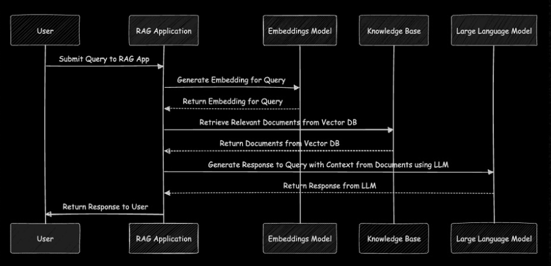

# Formula 1 RAG (Retrieval-Augmented Generation) Knowledge Base

## Project Overview

This project builds a specialized Retrieval-Augmented Generation (RAG) system for Formula 1. It ingests information from Wikipedia pages about Formula 1 and key drivers, processes this data with embeddings generated using OpenAI, and stores it in a database. The system allows users to query the database with natural language questions and receive accurate, context-rich answers about Formula 1.

## Features

- 🔄 **Web Scraping**:
  - Scrapes relevant data from specified URLs (e.g., Wikipedia pages) using Playwright.
  - Preprocesses text into smaller, manageable chunks for embedding generation.

- 🧠 **Embedding Generation**:
  - Uses OpenAI’s embedding model (`text-embedding-ada-002`) to encode text into high-dimensional vectors.

- 📊 **Database Integration**:
  - Creates a vector-based collection using DataStax Astra DB.
  - Uploads embeddings and corresponding text to the database for fast retrieval.

- ❓ **Natural Language Querying**:
  - Accepts user questions, generates embeddings for the query, and retrieves relevant context from the database.
  - Leverages GPT to generate detailed answers based on retrieved context.

## Requirements

### Libraries

Install the required libraries with:

```bash
npm install playwright openai @datastax/astra-db-ts
```

### External Dependencies

- **DataStax Astra DB**: Ensure you have an Astra DB instance set up, along with an API token.
- **OpenAI API**: Replace the placeholder `API_KEY` with your OpenAI API key.

## Usage

### 1. Clone the Repository

```bash
git clone https://github.com/username/f1rag.git
cd f1rag
```

### 2. Configure the Environment

- Replace `API_KEY` with your OpenAI API key.
- Replace `TOKEN` and `DB_URL` with your DataStax Astra DB credentials.

### 3. Add Data Sources

Modify the `urls` array in the `ingest` function to include additional URLs for expanding the knowledge base:

```javascript
const urls = [
    "https://en.wikipedia.org/wiki/Formula_One",
    "https://en.wikipedia.org/wiki/George_Russell_(racing_driver)",
    // Add more URLs here
];
```

### 4. Run the Ingestion Process

Execute the script to scrape data, generate embeddings, and upload them to the database:

```bash
node ingest.js
```

### 5. Query the Knowledge Base

Use the `askQuestion` function to query the database and receive answers:

```javascript
askQuestion("Why are George Russell and Max Verstappen arguing after Qatar 2024?").then((res) => {
    console.log(res);
});
```

## Example

### Input

Question: *"Why are George Russell and Max Verstappen arguing after Qatar 2024?"*

### Output

```text
Max Verstappen criticized George Russell's driving during the Qatar Grand Prix 2024, claiming it was overly aggressive, while Russell defended his actions, stating they were within racing rules.
```

## Script Breakdown

### Ingestion Script (`ingest.js`)

- **Scrape Web Pages**: Extracts text from specified URLs using Playwright.
- **Generate Embeddings**: Encodes chunks of text into vectors using OpenAI.
- **Upload to Database**: Stores the processed data in a vector database for querying.

### Query Script (`query.js`)

- **Generate Query Embedding**: Converts user questions into embedding vectors.
- **Retrieve Context**: Searches the database for the most relevant text based on the query.
- **Generate Response**: Uses GPT to create a coherent answer based on the retrieved context.

## Limitations

- ⚠️ The quality of answers depends on the relevance and quality of the ingested data.
- ⚠️ Requires an active internet connection for API access.
- ⚠️ Currently limited to English-language sources.

## Future Improvements

- 🌐 Expand data sources to include more Formula 1-related websites and forums.
- 🎓 Optimize the embeddings pipeline for faster processing.
- 🎮 Develop an interactive web interface for user queries.

## License

This project is licensed under the MIT License.

